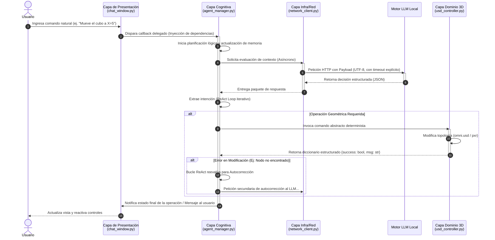

# Diseño del Sistema y Separación de Preocupaciones

## Fundamentos ISO/IEC 25010 y SoC

La implementación física de nuestro sistema abraza el principio de **Separación de Preocupaciones (SoC)** como vehículo primordial para cumplir y garantizar estándares exigidos por la norma **ISO/IEC 25010**.

1. **Mantenibilidad (Modularidad):** Al fraccionar el código en capas rígidamente segregadas, aseguramos que el reemplazo o evolución de un componente (por ejemplo, el backend LLM local o la inferfaz visual) impacte mínimamente al resto del código.
2. **Fiabilidad (Tolerancia a fallos):** El encapsulamiento preventivo restringe la onda expansiva de los fallos. Al separar el flujo conversacional asíncrono de la modificación directa del árbol de nodos USD en Omniverse, dotamos al software de la robustez requerida para manejar imprevistos externos de red o fallos deductivos del modelo, sin abatir el núcleo gráfico.

## Capas del Sistema

A nivel de implementación técnica y estructura de directorios, el ecosistema se descompone en las siguientes cuatro responsabilidades primarias:

- **Capa de Presentación (`ui/chat_window.py`):**
  Arquitecturada puramente bajo el patrón MVC, es una interfaz de usuario completamente "tonta" o agnóstica. No alberga ninguna lógica de negocio o deducción. Recibe notificaciones asíncronas para actualizar su estado y delega toda interacción explícita del usuario vía inyección de dependencias (callbacks delegados por la orquestación superior).

- **Capa de Infraestructura/Red (`logic/network_client.py`):**
  Responsable del aislamiento del protocolo de comunicación externo (ej., REST, WebSockets, streaming asíncrono). Actúa como escudo anti-bloqueo imponiendo tiempos de espera (timeouts) rígidos y codificando implícitamente todo payload transaccional en UTF-8 para garantizar un acople ininterrumpido con el Motor LLM perimetral.

- **Capa Cognitiva (`logic/agent_manager.py`):**
  Constituye la memoria e inteligencia táctica del sistema. Alberga el bucle de autorreflexión (ReAct Reflection Loop), encargado de parsear y validar la intencionalidad humana, orquestando y disparando comandos abstractos condicionados al contexto de la interacción. Aquí ocurre el análisis del entorno lógico antes de intentar modificaciones formales sobre el modelo virtual.

- **Capa de Dominio 3D (`logic/usd_controller.py`):**
  Encarna el adaptador físico del núcleo gráfico. Traduce, aplicando el Patrón Comando, las decisiones abstractas aprobadas por la Capa Cognitiva en operaciones OpenUSD directas y deterministas. Aísla las particularidades léxicas y lógicas del motor (`pxr`, `omni.usd`) para prevenir fugas de acoplamiento al exterior, reportando en diccionarios estructurados el éxito o fracaso inquebrantable de la operación geométrica.

## Diagrama Asíncrono de Flujo e Interacción

El siguiente diagrama ilustra el flujo de secuencia asíncrono que atraviesa las diferentes capas arquitectónicas, demostrando el desacoplamiento que salvaguarda el hilo principal de renderizado de la UI en Omniverse.

