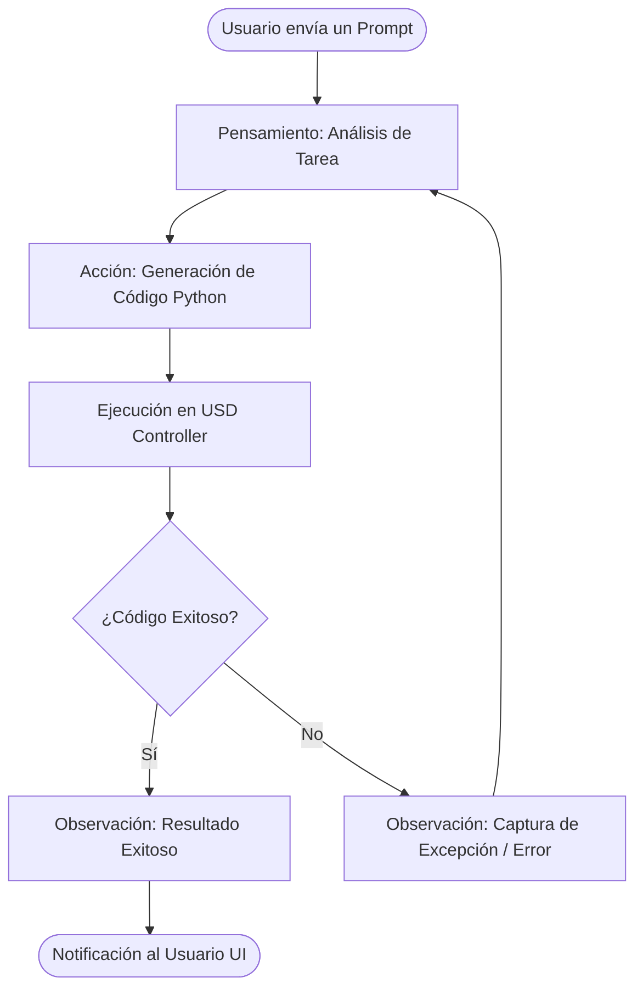

# Patrones de Diseño del Agente (IA)

Este documento define la arquitectura algorítmica y los mecanismos de memoria del Agente Híbrido, garantizando su capacidad de razonamiento iterativo y eficiencia de procesamiento local.

## 1. Patrón ReAct y Autorreflexión

El núcleo cognitivo de la IA se asienta sobre el patrón **ReAct** (Reasoning and Acting). El `AgentManager` actúa como orquestador del bucle de reflexión asíncrono para ejecutar operaciones. En lugar de una generación lineal *zero-shot*, el agente operará con un "Sistema 2" de pensamiento lento e iterativo.

La secuencia de control consta de:
1. **Pensamiento:** La IA planea y expone lógicamente su deducción.
2. **Acción:** Emisión del código final en Python (usando las APIs permitidas de Omniverse).
3. **Ejecución (Omniverse):** Ejecución del código Python generado dinámicamente mediante el motor subyacente.
4. **Observación:** Captura del resultado de la ejecución. Si ocurre un fallo topológico o de sintaxis, la pila de error se inyecta como una nueva observación para forzar la corrección en el siguiente ciclo.

### Diagrama de Flujo del Bucle de Reflexión

## 2. Optimización de la Ventana de Contexto (Context Window)

Para mantener la interoperabilidad con Modelos de Lenguaje Grandes (LLM) locales y eficientes de código abierto (como Llama o Gemma) en hardware de consumidor (Consumer GPUs), la administración de memoria del orquestador debe ser agresiva y predictiva.

Se empleará la táctica de **Resumen de Ventana Rodante (Rolling Buffer Compression)**.

Cuando la longitud combinada del historial de conversación y los ciclos de reflexión de errores rebase un límite de seguridad referencial de **8192 tokens**, el sistema aplicará una compresión activa:
- Mantendrá intactas las directrices fundamentales (Prompt del Sistema y metadatos de las APIs).
- Sintetizará el flujo conversacional y la cadena de errores pasados preservando únicamente la intención original (el *por qué* de las acciones), descartando las implementaciones erróneas ya superadas.

Esto asegura prevenir fallos de inferencia OOM (Out Of Memory) en el servidor LLM local y garantiza la velocidad (TPS) sin perder la coherencia contextual del requerimiento original.
